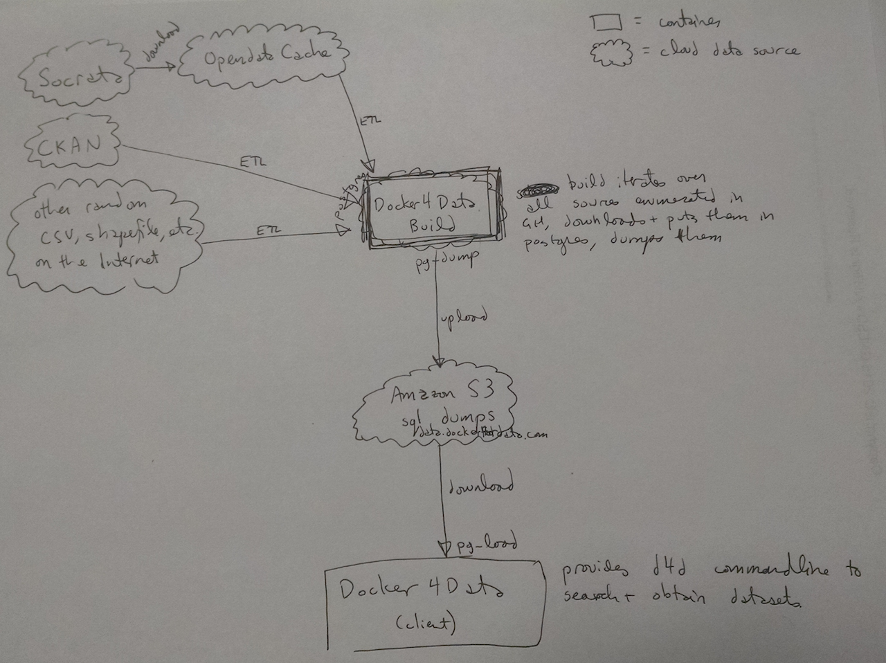
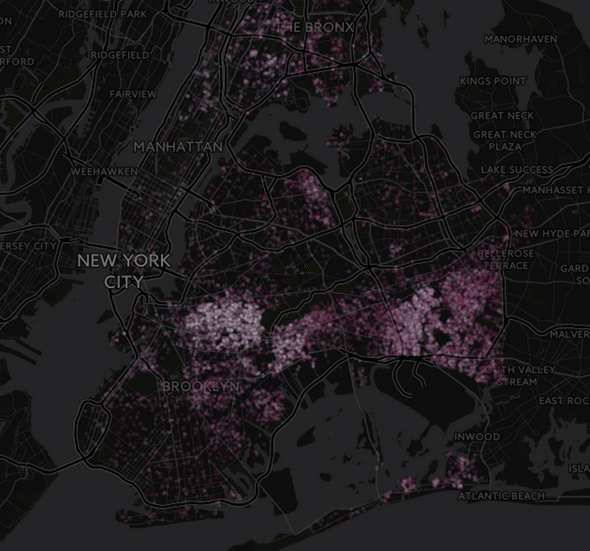

# Introduction

Open data has received a lot of attention. Some speak of open data as revolutionary, as much as open source was for software. The Web in general, Android and most of the technology sector would probably not be as successful without opensource technologies.

“Open data is data that can be freely used, reused and redistributed by anyone – subject only, at most, to the requirement to attribute and sharealike” [@Dietrich2009-ol]. According to McKinsey [@Manyika2013-ny], this can translate into $3 to $5 trillion in economic impact. Open data also creates large opportunities for innovation [@Zuiderwijk2014-mi] and social impact [@Howard2014-aq].

But in practice, the reality is somewhat different as described by some leaders of the opendata movement, e.g. [@Headd2015-cr,@Wellington_undated-ws]. Here is a somewhat contrived view of a the current situation. Someone – a civic hacker, a data journalist or a researcher in academia – willing to make sense of the data usually has to go through the following steps: (a) find the datasets they need, (b) realize that they are missing a few, (c) download the datasets, (d) create a schema and load the datasets into a database, (e) join the dataset into one or more views that make sense and finally (f) run queries against the dataset. This is not only time consuming (usually half a day of work) but also extremely frustrating. And the process has to be repeated whenever the datasets get updated.

In this paper, we present a novel approach to packaging opendata datasets called Docker for Data – inspired by the eponymous [@Docker_undated-hb] cloud container solution –  where we package datasets into coherent and self-contained units that can be deployed with a few clicks and used within minutes. 

The rest of this paper is organized as follows. We start with a motivating example of opendata in the context of real estate speculation in New York City and the diffulties one faces when trying to make sense of the data. We then describe the architecture of Docker for Data and show how it can be applied for our example. Before we conclude, we present some related and future work in this space. 

# Motivation
In the current state, if you are interested in exploring or answering questions using opendata, you have a few options.

First, you can rely on existing opendata portals like Socrata [@Socrata_undated-su] or CKAN [@Dietrich2009-rx] which are the go-to solutions for most cities. But such portals are really dataset-centric and offer very limited query capabilities, one dataset at a time. So, if your exploration require combining multiple datasets, you are out of luck.

Another option is to leverage cloud service providers like Amazon or Google. Either the datasets have been alread uploaded or you need to upload them. Then you can leverage their respective "big-query" solutions. This comes with some limitations in terms of what you can do. It also implies that whatever proprietary data you want to combine or "secret query" you want to run will be uploaded to someone else's cloud.

The last option is the DIY solution, as described in the introduction, which is both time consuming and frustrating.

The inspiration for this work was an interest in the housing market in New York City. Affordable housing has received a lot of attention in cities like New York City, San Francisco, etc, as the price of both buying a building and renting an apartment have risen drastically in just a few years.
People in the community, advocates, and politicians all want to understand why the city is becoming so expensive, what trends can be discovered, and what they can learn from such trends to try to keep their communities in place.

Remarkably, New York City makes publicly available its entire register of deeds and mortgages, called ACRIS [@New_York_City_Department_of_Finance_undated-jm], as open data in a machine-readable format.  Despite this, the data has seen little use in the community.  As a simple data exploration starting point, putting points on a map showing where property values were increasing rapidly, or where a certain bank was lending, would require:

#. Identifying which tables you would need from the open data portal to get the transactions (one table), the names of buyers, sellers, and banks (another table), and the lot identifiers for the properties sold or mortgages (another table).

#. Downloading these tables, which is 5GB of CSVs from the data portal.  This could take several hours if the downloads don’t fail.  You may have to start over from scratch if one does.

#. Find the geographic tables, which are linked to the open data portal but live elsewhere as shapefiles.  You would need some background knowledge of how to join lot identifiers to geographic info in order to know this table was the one you need.

#. Download the shapefile and convert it into a database format for the join.   You’ll also need to do this five times, as each borough is in a separate table.

#. Load the CSVs into a database for the join.  They’re too big to work with in a spreadsheet application.  There’s no officially documented schema, so you’ll need to figure it out yourself or search around on the web for one.  The load itself will take at least twenty minutes on standard hardware, unless you have installed more complicated software like pgloader.

#. Add the appropriate indices so the join is not very slow.  Write a view or derivative table that combines the four so you can query what you want to look for faster.

The data is open, but the process of using it is still so difficult as to discourage use.  Even after a civic-minded coder goes through the above process, it’s unclear how they can share their transformations with others. If you are simply a data enthusiast (with limited hacking skills), the barrier of entry is simply too high.

# Architecture & Implementation

Let's start with a little terminology.
We have some data sources, usually city or agency data portals running software like Socrata or CKAN. Each data source contains one or more datasets, usually CSV files. Docker for data defines recipes that map datasets into data dumps.

For Docker for data, we are  using Postgres as the database. A recipe defines a relational schema for a given dataset and describes the translation from a CSV file or shapefile into a Posgres data dump. For each dataset, there is a corresponding recipe. Using existing metadata from the dataset, the translation can be done automatically.
Other recipes can be defined manually, to combine datasets together, either as relational views or brand new tables.

The GovLab maintains a build server, whose processes can be viewed at build.dockerfordata.com, which reads the recipes and uploads the SQL output to S3.   The build server is also packaged as a Docker container and could easily be run by a third party.

Our docker client (deployed by our user) makes it easy to look for recipes, download the corresponding data dump locally and load the data into the database.

The architecture of the Docker for Data is described in Figure 1.

# Revisiting our housing example

In this section, we revisit our motivating example and show how we are doing it in the context of Docker for Data. The source code is available from http://github.com/talos/docker4data.

The ACRIS deed and mortgage data is published by the city of New York on its open data portal. The build server is able to automatically generate recipes from the portal. This is one of the three automatically generated recipes:

~~~~~~~
source  = //data/socrata/data.cityofnewyork.us/acris_real_property_master/data.
{
  "data": "http://www.opendatacache.com/data.cityofnewyork.us/api/views/bnx9-e6tj/rows.csv", 
  "description": "Document Details for Real Property Related Documents Recorded in ACRIS", 
  "maintainer": {
    "@id": "https://github.com/talos/docker4data"
  }, 
  "metadata": {
    "attribution": "Department of Finance (DOF)", 
    "category": "City Government", 
    "description": "Document Details for Real Property Related Documents Recorded in ACRIS", 
    "socrata": {
      "@id": "http://www.opendatacache.com/data.cityofnewyork.us/api/views/bnx9-e6tj.json"
    }
  }, 
  "name": "ACRIS - Real Property Master", 
  "status": "needs review", 
  "table": "acris_real_property_master"
}
-- automatically generated
~~~~~~~

The other two recipes are very similar and can be found [here](https://github.com/talos/docker4data/blob/master/data/socrata/data.cityofnewyork.us/acris_real_property_legals/data.json) and [here](https://github.com/talos/docker4data/tree/master/data/socrata/data.cityofnewyork.us/acris_real_property_parties).

ACRIS does not include geographical data, so it has to be combined with the city’s tax lot map.  This is not hosted on the open data portal, but this user-contributed recipe adds it to Docker for Data:

~~~~~~~
source = //data/contrib/us/ny/nyc/pluto/data.json
{
  "data": "http://www.nyc.gov/html/dcp/download/bytes/nyc_pluto_14v1.zip",
  "table": "pluto"
}
~~~~~~~

~~~~~~~
source = //data/contrib/us/ny/nyc/pluto/before.sh
#!/bin/bash

unzip data

ls *.csv | \
  tail -n 1 | \
  xargs head -n 1 | \
  sed -E 's/ +/ /g' \
  > data.concatenated

ls *.csv | \
  xargs tail -q -n +2 | \
  sed 's/[^[:print:]]//g' | \
  sed -E 's/ +/ /g' \
  >> data.concatenated

mv data.concatenated data
~~~~~~~

With all the data sources available on Docker for Data, a final bundle can be defined that combines them into a usable table showing deed transfers in NYC from 1966 to the present. 

~~~~~~~
source = //data/contrib/us/ny/nyc/deeds/data.json
{
  "requirements": {
    "socrata/data.cityofnewyork.us/acris_real_property_master": "latest",
    "socrata/data.cityofnewyork.us/acris_real_property_legals": "latest",
    "socrata/data.cityofnewyork.us/acris_real_property_parties": "latest",
    "socrata/data.cityofnewyork.us/acris_document_control_codes": "latest",
    "contrib/us/ny/nyc/pluto": "latest"
  }, 
  "description": "All real property sales, with location, for New York City from 1966 \
  to the present, derived from ACRIS.", 
  "maintainer": {
    "@id": "https://github.com/talos/docker4data"
  }, 
  "metadata": {
    "category": "City Government"
  }, 
  "table": "deeds"
}
~~~~~~~

and 

~~~~~~~
source = //data/contrib/us/ny/nyc/deeds/after.sql

CREATE TABLE deeds_master
AS
SELECT DISTINCT (
       CASE substr(document_id, 0, 3)
          WHEN '20' THEN document_id
          WHEN 'FT' THEN '100' || substr(document_id, 4)
          WHEN 'BK' THEN '000' || substr(document_id, 4)
          ELSE document_ID END)::BIGINT as document_id,
       m.good_through_date, m.document_date,
       m.document_amt, m.recorded_datetime, m.modified_date,
       dcc.doc__type_description, dcc.doc__type as doc_type
 FROM "socrata/data.cityofnewyork.us".acris_real_property_master m,
      "socrata/data.cityofnewyork.us".acris_document_control_codes dcc
WHERE dcc.class_code_description = 'DEEDS AND OTHER CONVEYANCES' AND
      dcc.doc__type = m.doc_type
;

DELETE FROM deeds_master USING deeds_master alias
  WHERE deeds_master.document_id = alias.document_id AND
    deeds_master.good_through_date < alias.good_through_date;

CREATE UNIQUE INDEX deeds_master_docid ON deeds_master (document_id);

CREATE TABLE deeds_parties
AS
SELECT DISTINCT m.document_id, p.good_through_date,
      CASE p.party_type WHEN '1' THEN dcc.party1_type
                        WHEN '2' THEN dcc.party2_type
                        WHEN '3' THEN dcc.party3_type
      ELSE p.party_type END AS party_type,
      p.name, p.addr1, p.addr2, p.country, p.city, p.state, p.zip
FROM "socrata/data.cityofnewyork.us".acris_real_property_parties p,
     deeds_master m,
     "socrata/data.cityofnewyork.us".acris_document_control_codes dcc
WHERE (CASE substr(p.document_id, 0, 3)
          WHEN '20' THEN p.document_id
          WHEN 'FT' THEN '100' || substr(p.document_id, 4)
          WHEN 'BK' THEN '000' || substr(p.document_id, 4)
          ELSE p.document_id END)::BIGINT = m.document_id AND
      m.good_through_date = p.good_through_date AND
      SUBSTR(p.document_id, 4) ~ '^[0-9]+$' AND
      dcc.doc__type = m.doc_type;
CREATE INDEX deeds_parties_docid ON deeds_parties (document_id);

CREATE TABLE deeds_legals
AS
SELECT DISTINCT m.document_id, m.good_through_date,
       (borough * 1000000000) + (block * 10000) + lot as bbl,
       l.easement, l.partial_lot, l.air_rights, l.subterranean_rights,
       l.property_type, l.addr_unit
FROM "socrata/data.cityofnewyork.us".acris_real_property_legals l,
     deeds_master m WHERE (CASE substr(l.document_id, 0, 3)
          WHEN '20' THEN l.document_id
          WHEN 'FT' THEN '100' || substr(l.document_id, 4)
          WHEN 'BK' THEN '000' || substr(l.document_id, 4)
          ELSE l.document_id END)::BIGINT = m.document_id AND
      m.good_through_date = l.good_through_date;
CREATE INDEX deeds_legals_docid ON deeds_legals (document_id);

CREATE TABLE deeds AS
SELECT m.*, l.easement, l.partial_lot, l.air_rights, l.subterranean_rights,
       l.property_type, l.addr_unit, party_type,
      p.name, p.addr1, p.addr2, p.country, p.city, p.state, p.zip, pl.bbl, pl.cd,
      pl.ct2010, pl.cb2010, pl.council, pl.zipcode, pl.address, pl.unitsres,
      pl.unitstotal, pl.yearbuilt, pl.condono, pl.geom
FROM deeds_legals l, deeds_master m, deeds_parties p, "contrib/us/ny/nyc".pluto pl
WHERE l.document_id = m.document_id
      AND m.document_id = p.document_id
      AND l.bbl = pl.bbl;
~~~~~~~

The command to install Docker for Data is:

~~~~~~~
curl -s http://git.io/vYsiV | bash
source ~/.bash_profile
~~~~~~~

The command to download the dataset and load it into the local container is:

~~~~~~~
d4d install nyc/deeds
~~~~~~~

Installing the deeds table will take about five minutes on a high-speed connection, with the resulting table having about 10 million rows.

To run a query, simply type the following command and you are inside a Postgres environment, with all the tables loaded for you and ready to be queried.

~~~~~~~
d4d psql
~~~~~~~

For example, for a list of the top 100 addresses most often used when buying or selling properties, one would only need this query:

~~~~~~~
SELECT
  COUNT(DISTINCT document_id) num_transactions,
  COUNT(DISTINCT geom) num_properties,
  COUNT(DISTINCT name) num_names,
  MIN(document_date) first_purchase,
  MAX(document_date) last_purchase,
  addr1 address
FROM deeds
GROUP BY addr1 
ORDER BY COUNT(DISTINCT geom) DESC
LIMIT 100;
~~~~~~~

Docker for Data is already being used by data activists in New York.  The Real Estate Investment Cooperative ([REIC](http://nycreic.com/)) has used the real estate data from Docker for Data to visualize “flips” in the city, or properties that have sold at 50%+ markups in less than two years.

The interactive map can be browsed at http://bit.ly/1TiDTxB[^cartodb].

[^cartodb]: https://docker4data.cartodb.com/viz/34453774-28da-11e5-8e42-0e0c41326911/public_map

In the hands of REIC, open data from Docker for Data can be used to argue that an increase of 1% in the real property transfer tax could provide a sustainable stream of millions of dollars for affordable and cooperative housing in areas most affected by speculative real estate investment.

# Related and Future Work

## Related work
Socrata [@Socrata_undated-su] and CKAN [@Dietrich2009-rx] are the two main opendata portal software. As mentioned before, they are dataset centric and offer very limited query capabilities. They focus more on data publishing. Downloading from a data portal is usually slow as cities and agency don't like to invest too much on bandwidth.
Hosted datasets, e.g. Amazon, Google, provide prepackaged solutions that do not always offer enough flexibilities. Open civic data is very location-centric and such solutions are often weak in terms of GIS features.
In both cases, the end user must rely on somebody else hosted solution. Uploading proprietary data or logic is problematic.

Docker for Data is not the first attempt at packaging data in an end-user friendly way. The city of Philadelphia was experimenting with sqlite bundles on its opendata portal [@Headd2013-oa]. The PC-AXIS file format [@noauthor_2013-je] is an attempt at making datasets optimized for OLAP applications with rolling-up and drilling-down queries.

## Future work
With minimal work, we could increase the number of automatically collected datasets.  We only automatically generate recipes for datasets posted on Socrata data portals. It should be possible to include CKAN portals into the automatically generated mix.

While it’s possible to add your own recipes to Docker for Data, the tooling could use improvement.  Developing a parallel tool to the client “d4d” tool called “b4d” to make it easy to write and contribute new recipes would be essential to allowing people to contribute their work.   The toolchain could take advantage of interactive tools like iPython to save a workflow as a recipe.

The client is still very simple, and not clever enough to eliminate unneeded artifacts, requirements, and temporary tables.  This means that data can end up being duplicated on S3.

Since Docker for Data is packaged as a container, it would be possible to add additional modules, also packaged as containers, that supply visualization output or database administration outside of the command line. Recipes could contain pre-packaged templates and queries that can be activated with the addition of the necessary module.  

Datasets are not currently versioned, and when updates happen the assumption must be to throw away the old data and replace it with the new.  There could be efficiencies with projects like dat or within S3 itself to version and stream only changed sections of data.

Search and discovery are currently limited. A full-text search with ranking by relevance could be implemented on top of existing metadata.

Using the large collection of pre-collected data and extensive schema available, it should be possible to provide suggestions for possible joins between disparate datasets.

# Conclusion

As we advocated in a related paper [@Sahuguet2014-px], opendata is really data "of the people, by the people, for the people". The current effort to make lots of data open is great, but this is just tackling the first step, publishing. Make this data easy to download and use is really the next step and this is the problem we are trying to solve with Docker for Data. Borrowing from the Docker (Docker ) play-book (and DevOps more generally), we propose a way to package datasets into self-contained data bundles that be deployed quickly and easily. We also present a concrete application for real-estate data in New York City.

# References
