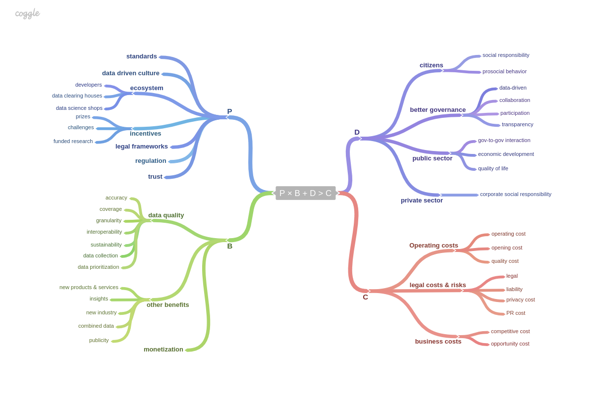

# Introduction
The value, impact and promise of making data publicly accessible have driven citizens, government agencies and businesses to embrace open data as a way to increase efficiency, promote transparency and maximize utility.

"Open data is data that can be freely used, reused and redistributed by anyone - subject only, at most, to the requirement to attribute and share-alike" [@Dietrich2009-ol]. 
McKinsey [@Manyika2013-ny] estimates more than $3 trillion in additional value globally as a result of open data. Large scale studies such as the Open Data 500 reveal an impact across sectors such as energy, consumer products and healthcare. More than 40 countries have shared over a million government datasets. Shared corporate data provides mutual benefits for both public and private sector entities, e.g. Uber’s partnership with the City of Boston [@Uber2015-bk], the Twitter-MIT Laboratory for Social Machines [@MIT_Media_Lab_undated-bw]and Yelp’s Dataset Challenge [@Yelp_undated-bc].

While the rise of the open data movement has led to numerous commitments and increasing enthusiasm to unleash the potential of open data, data providers lack a common language for evaluating and weighing the decision to open their own data.

Government agencies and city officials often open their data as a result of top-down pressure to champion efficiency, meet citizen demand or increase transparency through the number of datasets released rather than the impact these datasets may create. They often do not understand the hidden costs associated with opening their data and miss opportunities to leverage knowledge from communities or outside expertise for optimal data sharing.

Corporations are mostly embracing a wait-and-see attitude. While some have begun sharing corporate data for research or policymaking intended for public benefit, others are building business models from public open data. Since data is seen as a business asset holding significant value, companies are cautiously considering why they should take on risks to competition and engage in activity amidst nascent legal and regulatory frameworks.

End users are motivated to share their data. However, they often are not the true __owners__, their data being stored and managed on their behalf by technology and social media companies. Even when they are, the fear of unwanted government surveillance or corporate marketing practices dissuades them from making their data more publicly accessible.

# Stories from the field
We briefly start with a few selected examples to highlight the value and impact of open data and the need for a better decision framework when choosing to open data.

## Success and horror stories
We’ve seen the success stories and numerous examples of open data. Public transit information (made available by cities via Google GTFS standard) is saving time to millions of people on a daily basis. GPS data is at the core of mobile location-based services and products. Weather information from the National Oceanic and Atmospheric Administration (NOAA) is used by weather companies and insurance agents such as The Weather Channel and the Climate Corporation. The open nature of the data in the Human Genome Project fostered at-scale collaboration in decoding the genome and creating an ecosystem of innovation among academic and private researchers.

We’ve also witnessed the horror stories. A seminal example was the release of search logs by AOL for academic research purposes in 2006. The released data contained some publicly-identifiable information (PII) on AOL members that made it possible to identify people and reveal their internet search histories. More recently, the release of improperly anonymized taxi data from the New York City Taxi & Limo Commission revealed the identities of taxi drivers, trips of celebrities and even the religious orientation of some drivers.

## The hard questions
For all these cases, here are some questions that are hard to answer today:

\vspace{0mm}

#. why did stakeholders choose to open (or not open) their data?
#. what incentives could have been put in place to encourage (or discourage) opening and sharing of data?
#. among the various levers one can pull, which one makes the most sense for the data provider?

# A calculus for open data

Our calculus centers around a simple equation:
\begin{equation}
P \times B + D > C
\end{equation}
where

P is the probability that opening the data will have some effect,
B is the individual benefit of opening the data,
D is the global or ecosystem impact, and
C is the cost.
Any increase in P, B or D and a decrease in C will make the outcome of opening the data better.

Let's now revisit each variable one by one and look at concrete factors that influence it.

## P for probability
*P* represents the probability that opening the data will generate potential benefits for the data owner.

Factors that make *P* go up include:
\vspace{0mm}

* standards to publish the data
* a data-driven culture inside public and private sectors, fostered by strong education offerings.
* an ecosystem of data consumers, with a hackers/developers to build products, clearinghouses to store and curate data (e.g. Enigma), data science shops (e.g. Kaggle, DataKind, Bayes Impact).
* incentives for consumers to use the data, e.g. prizes & challenges (NYC BigApps, Netflix Prize) or funded research (e.g. Twitter Data Grants).

Factors that make *P* go down include:
\vspace{0mm}

* the absence or inflexibility of legal frameworks, e.g. rigid or non-existent legal framework around data
* the lack of trust among the various players.

## B for benefits
The potential benefits *B* for the entity opening data include benefits about the quality improvement for the data after being released:
\vspace{0mm}

* better accuracy and less errors as a result of public scrutinization of the data
less gaps in the data in terms of coverage & granularity coming from external contribution
* better interoperability as a result of un-siloed data
sustainability of data
* data prioritization, to help identity most impactful datasets
* improved data collection by other public institutions (decreasing unnecessary duplication and associated costs)

Interesting findings about the data may be valuable and result in increased political, social and economic benefits for the data owner, including:
\vspace{0mm}

* development of new products and services
* creation of new insights in the public sector
* creation of a new sector adding value to the economy
* creation of new data based on combining data
* visibility and publicity for the data provider
* improvement of citizen services

This category of benefits varies greatly based on the type of data being opened up.

In addition, opening the data might create some monetization opportunities. For instance, a city could sell access to real-time feeds of its data (e.g. to hedge funds, insurance companies) while making the exact same data publicly accessible but delayed on its portal within a week.

## D for duty
*D* stands for Duty in the original paper. In our setting it translates more into "ecosystem impact" or "global impact", and is industry specific. This represents the positive impact of opening the data for other players.

Public entities will see the value of opening the data in terms of better governance (transparency, democratic accountability, collaboration, participation), improved quality-of-life for citizens, better government-to-government interactions, equal access to data and better economic development.

Private entities will see the value more in terms of corporate social responsibility.

End users will see value in terms of social responsibility and pro-social behavior.

## C for costs
Finally *C* stands for cost which is influenced by the following factors.
\vspace{0mm}

* Opening costs, i.e. the costs of opening the data itself. These costs involve the costs of transitioning data buried inside legacy systems and reformatting the data into an open format.

* Operating costs, i.e. the cost of publishing the data and keeping it fresh. Even with affordable commercial offerings and open source solutions, there is still a cost in running an open data portal.

* Quality costs, i.e. costs of keeping the data fresh.

* Legal costs, i.e. costs of opening the data in compliance with the various legislations. Finding legal expertise in this relatively new field can be hard to find and therefore expensive; this is even worse when dealing with multiple legal jurisdictions lacking harmonization (e.g. Europe vs. U.S.).

* Liability costs and risks, i.e. the costs when something goes wrong such as privacy, erroneous data, stale data. Again, the lack of legal clarity makes this risk harder to quantify.

* Mandatory costs, i.e. when opening the data is a legal requirement (resp. a right) and not doing so results in fines (resp. cost, e.g. FOIA in the U.S.).

* Competitive cost (for corporations), i.e. the cost of sharing information that can be used by the competition.

* Privacy cost (for individuals), i.e. the cost of sharing information that can be used to reduce quality of life, e.g. spam, insurance premium, etc.

* Public relations costs, i.e. the cost incurred from bad press due to information gleaned from the data, e.g. performance metrics for a city, environment metrics or workforce diversity for a corporation.

* Opportunity costs, because the same resources (money, technical infrastructure, human resources) could be spent doing something else.

* Particular categories of costs (e.g. transition, privacy, opportunity) will vary based on each industry.

\begin{figure*}[htbp]
\centering
\includegraphics[width=\textwidth]{images/pbdc_equation.png}
\caption{The various factors}
\end{figure*}

<!--

-->

## Pulling the levers
The equation describes a quantity that should be greater than zero for opening the data to make sense. In some practical situations, some variables may be beyond the control of the data owner. The equation provides guidance in terms of what levers can be used and points to additional decisions to be considered.

**Focus on P: increase probability of benefits**
\vspace{0mm}

- Have we invested in the right people, culture to move this initiative forward?
- How usable is the data for a hacker community to build off of?
Focus on B: increase benefits from the data
- Is there an easy mechanism for users of the data to provide some feedback?
- How does the data interact with related datasets and systems (e.g. interoperability)?

**Focus on D: value duty and ecosystem impact**
\vspace{0mm}

- What’s the potential value chain impact from opening up the data? Who benefits from opening up this data?
- What relationships or goodwill can we forge by making this decision?

**Focus on C: reduce costs**
\vspace{0mm}

- What are the real costs in transitioning and reformatting data into a usable format?
- What are the maintenance costs associated with opening the data?

The nature of the equation involves weighing a combination of approaches increasing P, B and D while decreasing C. The following examples illustrate these approaches in action toward more optimal sharing.

# Revisiting 3 examples
We revisit 3 typical use cases for open data and see how the calculus can help identify the levers that can be used to improve the outcome.

## Example 1: API
Cities (and governments more generally) often start their open data efforts by simply offering raw access to their bulk datasets and only consider API as an after thought. That’s often an oversight.

APIs force the use of standards (P$\uparrow$); facilitate the organization of prize and challenges (P$\uparrow$).

APIs are by nature hacker-friendly (P$\uparrow$). APIs are also the natural conduit for data monetization (P$\uparrow$).

APIs can be expensive to create and maintain (C$\uparrow$); but they also provide a better data granularity which helps with privacy and can reduce legal liabilities (C$\downarrow$).

So overall, APIs usually look like a good value proposition. Access to affordable tools and pre-existing standards can reduce the cost even more and make this option a no-brainer.

## Example 2: City Data Portals
The city data portal is the web presence where a city decides to publish the datasets it is opening.

First, running such a portal costs money in terms of storage and bandwidth (C$\uparrow$) . If the portal permits to run complicated queries against the data, a computation cost gets introduced (C$\uparrow$). If the portal contains some social features like a forum, a community manager is needed (C$\uparrow$) to handle people’s request and handle communication issues.

A good data portal will make the data easier to discover for end users (P$\uparrow$).

User feedback will improve the quality of the data (B$\uparrow$) and increase user engagement (P$\uparrow$, D$\uparrow$).

A good data portal will also benefit city agencies who can discover and leverage each other’s data (D$\uparrow$). Proactively opening the data is also a good way to avoid numerous and expensive FOIA requests (C$\downarrow$).

Given the availability of good data portal tools (e.g. Socrata, CKAN, Github) and cheap hosting, the cost C is often low and a City Data Portal is usually a good option.

## Example 3: Citizen Digital Philanthropy
User data can be very useful for research purposes for instance in the medical field or urban planning field. As a civic minded user, I am interested in donating my personal data. P, B and D are already high. But so is C.

In most cases, my data is actually locked at/by some provider which makes it hard to share in the first place (C$\uparrow$). Also, there is little guarantee about the respect of my privacy (C$\uparrow$). There is also a risk that the data I open will not be used for the exact purpose I have in mind which is captured in our equations by a lower benefit (B$\downarrow$).

In this use case, the critical element seems to be cost. The existence of data clearinghouses that can anonymize data and guarantee the appropriate use of the data (per the user’s request) would make such form of philanthropy possible to user by reducing C. The use case also requires an environment where the user is actually in control of her data.

# Conclusion
A simple equation will not answer all the questions about open data. Despite all its limitations, we think that this "calculus" can be useful as a way of anchoring the conversation, similar to Anthea Watson Strong's The Three Levers of Civic Engagement [@Strong2014-no].

Looking at the formula, decision makers can see how a given factor influences the outcome. Internally, the formulation could form the logic basis for a performance measurement and decision making tool. Externally, this could be extremely valuable for governments trying to engage the private sector in sharing private sector data or for the tech community in identifying technologies that would reduce cost or amplify benefits.

By just looking at the levers, one can reasonably anticipate that (1) data marketplaces where corporations can exchange data, (2) trusted 3rd parties offering aggregation and anonymization of end user data and (3) templates — both legal and database schemas — incorporated in software portal solutions would make decisions to open data more feasible and rational for data providers.

We hope that our "calculus" for open data can better frame the question of opening the data, help identify the various levers that can be pulled and facilitate conversations and research on this topic at all levels.

# References
